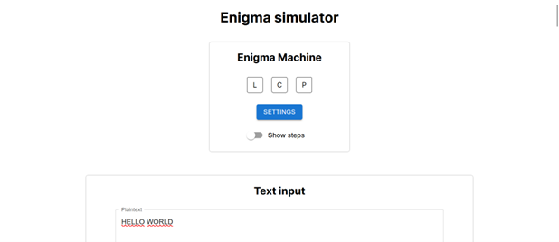
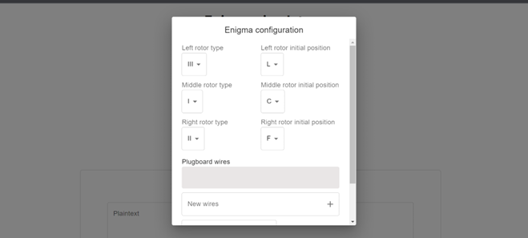
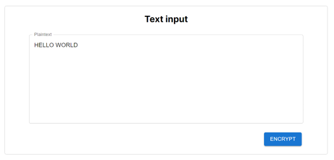
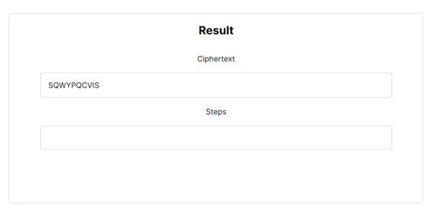

## Description






## How to Use

1. Run locally or click [here](https://enigma-code-implementation.vercel.app/) to run remotely
2. Click `SETTINGS` button to set up the Enigma configuration
3. Insert rotor type and initial letter for each rotors
4. [Optional] Insert plugboard wires. The correct format is `AB JC EK QL`. Click the `+` button
5. [Optional] To remove plugboard wires, select the wire to remove and click the trash button
6. Click `save`
7. [Optional] If you want to show the encryption steps, check the `Show steps` switch
8. Insert the plaintext in the input form
9. Click `encrypt`
10. The ciphertext and steps will be shown in the result box.

## How to Run Locally

1. Clone this repository

   ```bash
   git clone https://github.com/haziqam/enigma-code-implementation.git
   ```

2. Navigate to the root directory of this project

   ```bash
   cd enigma-code-implementation
   ```

3. Install dependencies

   ```
   npm install
   ```

4. Run the development server:

   ```
   npm run dev
   ```

5. Open [http://localhost:3000](http://localhost:3000) with your browser to see the result.

## Technologies used

- [Next.js](https://nextjs.org/) as project framework
- [Vercel](https://vercel.com/) for deployment
- CSS for custom styling

## Author

- Haziq Abiyyu Mahdy (13521170)
